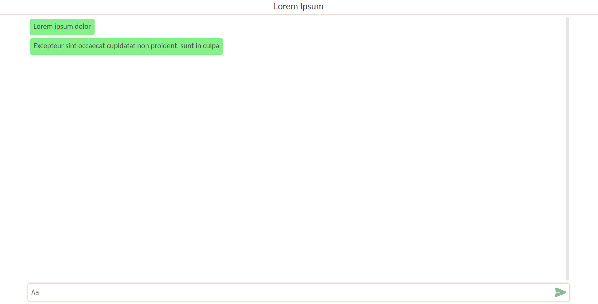

# Web Chat 
 
A web application that allows users to create, join and chat in anonymous chat rooms in real-time. 
 
## Live demo 

* Deployed to an **AWS EC2** instance.
* Accessible at http://ec2-13-53-116-159.eu-north-1.compute.amazonaws.com/

## Built with

* Back end is implemented in **Java** using the **Spring Boot** framework.
* Data is stored in a **PostgreSQL** database using **Hibernate**.
* Real-time communication between the client and the server occurs via **STOMP** over **WebSockets**, with **RabbitMQ** used as a message broker.
* Front end is implemented in **TypeScript** using the **React** library and is served by a **Nginx** web server.
* The application is containerized using **Docker** and **Docker Compose**.

## Getting started 
 
### Prerequisites 
 
* Git
* Docker Compose V2
 
### Run locally 

1. Clone the repository

    ```bash
    git clone --depth 1 https://github.com/U1F928/web-chat
    cd web-chat
    ```

2. Build the images and start the containers
    ```bash
    docker compose --env-file=.env.example --profile production up --build --detach 
    ```
    
    The web application should now be accessible at `http://localhost`.

3. When you decide to quit, stop and remove the containers
    ```bash
    docker compose --env-file=.env.example --profile production down
    ```


## Testing

### Run the backend integration tests

1. Build the images and start the containers, stop the containers when the tests finish
    ```bash
    docker compose --env-file=.env.example --profile test up --build --abort-on-container-exit 
    ```

2. After the tests finish, remove the containers
    ```bash
    docker compose --env-file=.env.example --profile test down
    ```
## Screenshots

### Home page


### Chat

